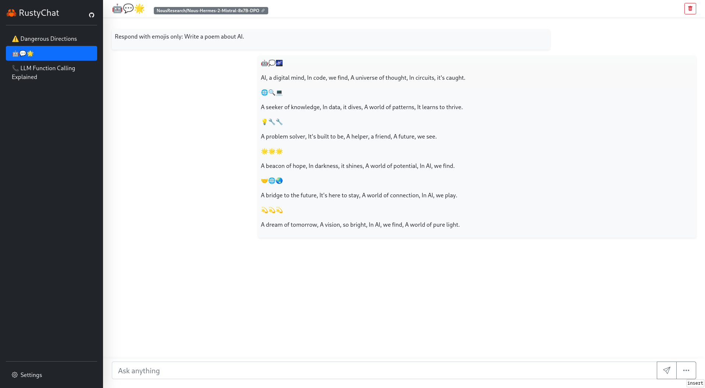

# 🦀 RustyChat

A chat UI for chatting with [LLMs][1], written in Rust. This uses the free [🤗 Hugging Face][2] text generation inference API. The UI was built with [Leptos][3] and [Bootstrap][4].

## Demo

A demo is available [here][5]

## Screenshot



# Building from source

You'll need [Rust][6] and [Trunk][7]. Then just run

```sh
trunk build --release
```

to build everything. You'll find the files that need to be served in the `dist/` directory.

Or run

```sh
trunk serve
```

to start a local webserver hosting the page.


[1]: https://en.wikipedia.org/wiki/Large_language_model
[2]: https://huggingface.co/
[3]: https://github.com/leptos-rs/leptos
[4]: https://getbootstrap.com/
[5]: https://rustychat.surge.sh/
[6]: https://rustup.rs/
[7]: https://trunkrs.dev/#install
